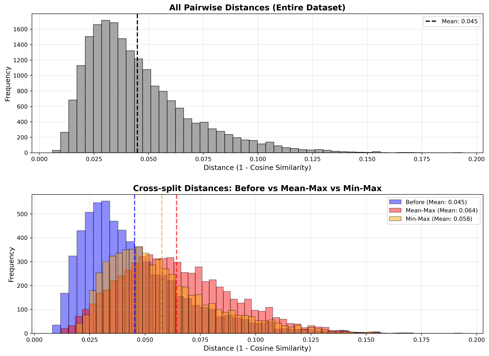
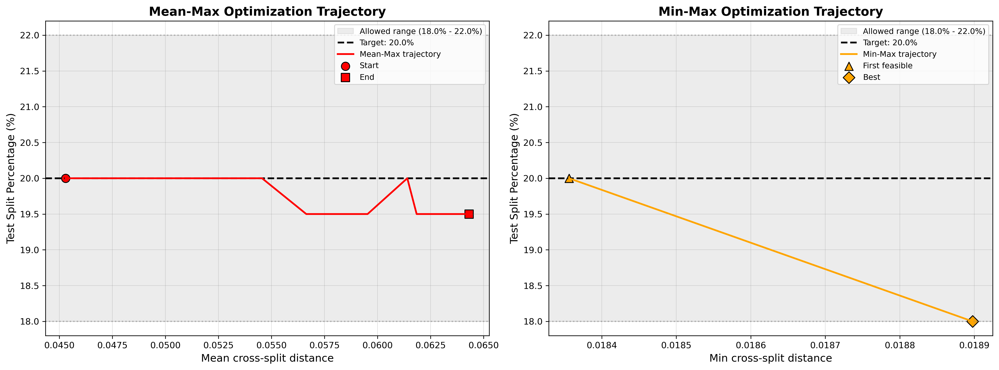
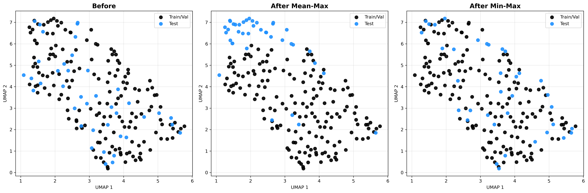

# Min-Leakage Data Splitting

A method for splitting datasets into train/val and test sets that maximizes the separation between splits while maintainig a target split ratio. This is particularly useful for preventing data leakage in machine learning by ensuring test sets are maximally dissimilar to training data.

## Method

The `MinLeakageSplitter` implements two optimization strategies:

### Mean-Max Optimization

Maximizes the **mean cross-split distance** between train/val and test sets. Uses a greedy search with candidate sampling to iteratively move samples between splits, maintaining the target split ratio within a buffer range. The algorithm:

- Starts with a random or provided initial split
- At each iteration, evaluates multiple candidate moves (swaps, transfers)
- Accepts moves that increase the mean cross-split distance
- Maintains split size within the allowed range (target ± buffer)
- Stops when no improvement is found for a specified number of iterations

**Objective**: Create an **edge-of-distribution test set** within the available samples. By maximizing average dissimilarity, Mean-Max pushes test samples away from the training distribution, making the test set more challenging and better for evaluating generalization to dissimilar data.

### Min-Max Optimization

Maximizes the **minimum cross-split distance** (the smallest distance between any train/val sample and any test sample). Uses binary search over distance thresholds:

- Builds a graph where edges connect samples with distance < threshold
- Uses union-find to identify connected components.
- Uses dynamic programming to find if a valid split exists (components can be assigned to test set to meet size constraints)
- Binary searches for the maximum threshold that still allows a feasible split

**Objective**: Achieve a **maximally dissimilar in-distribution test set**. By maximizing the worst-case separation, Min-Max ensures no test sample is too similar to any training sample, creating a test set that is as different as possible while still being drawn from the same underlying distribution.

## Example: Protein Sequence Dataset Splitting

The `protein_splitter.py` script demonstrates using the splitter with protein sequences:

1. Loads protein sequences (or generates random ones)
2. Computes ESM2 embeddings for each sequence
3. Builds a cosine distance matrix from embeddings
4. Runs both Mean-Max and Min-Max optimizations

### Usage

```bash
python protein_splitter.py --sequences sequences.txt --desired_test_split_pct 20.0 --buffer_pct 2.0
```

### Figures

**Edge Distributions** (`edge_distributions.png`)



Shows distance distributions:
- Top panel: All pairwise distances in the dataset (grey histogram with dashed mean line)
- Bottom panel: Cross-split distances before optimization (blue), after Mean-Max (red), and after Min-Max (orange), with matching colored dashed mean lines

**Optimization Trajectories** (`trajectory.png`)



Shows optimization progress:
- Left panel: Mean-Max trajectory (x-axis = mean cross-split distance)
- Right panel: Min-Max trajectory (x-axis = min cross-split distance)
- Both show test split percentage vs. distance metric, with target range highlighted

**UMAP Embeddings** (`umap_embeddings.png`)



2D UMAP visualization of the splits:
- Three panels: Before optimization, After Mean-Max, After Min-Max
- Black points = Train/Val, Blue points = Test
- Shows how optimization separates test samples from training data in embedding space

## Key Features

- Maintains target split ratio (with configurable buffer)
- Works with any distance metric (cosine, Euclidean, etc.)
- Two complementary objectives: mean separation vs. worst-case separation
- Efficient algorithms suitable for medium-sized datasets
